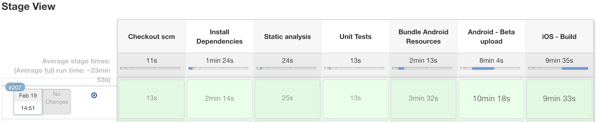

# Mobile jenkins shared library

Jenkins [shared library](https://jenkins.io/doc/book/pipeline/shared-libraries/)
to build Android, iOS and React Native apps.

## Installation

You can configure in Jenkins [global](https://jenkins.io/doc/book/pipeline/shared-libraries/#global-shared-libraries),
or using [CloudBees Folders Plugin](https://wiki.jenkins.io/display/JENKINS/CloudBees+Folders+Plugin) you can configure
for [folder level](https://jenkins.io/doc/book/pipeline/shared-libraries/#folder-level-shared-libraries).

## Usage

### Project requirements

#### Android
* [gradle wrapper](https://docs.gradle.org/current/userguide/gradle_wrapper.html)
* Android SDK
* Android emulator or connected device
* set correct path to android sdk in [AndroidUtilities.groovy](https://github.com/mgasiorowski/mobile-jenkins-shared-library/blob/master/src/io/jenkins/mobilePipeline/AndroidUtilities.groovy#L12) ([Issue](https://github.com/mgasiorowski/mobile-jenkins-shared-library/issues/4))

#### iOS
* [fastlane](https://github.com/fastlane/fastlane)
* Xcode

### Jenkinsfile

To build your projects with this library, you must have Jenkinsfile in you repository, and configure Jenkins to use it 
(you can have more than one Jenkinsfile).

[Full documentation](https://github.com/mgasiorowski/mobile-jenkins-shared-library/blob/master/docs/README.md)

**Example Jenkinsfile**
```
#!groovy
 
@Library('jenkins-mobile-pipeline-shared-libraries') _
 
pipelineOptions{
    maxNumberBuildsToKeep = 10
}
 
checkoutScm {
    nodeLabel = 'centos_7'
}
 
reactNativeInstallDependencies {
    nodeLabel = 'centos_7'
    dependencyInstallationCommand = 'wget https://github.com/yarnpkg/yarn/releases/download/v1.1.0/yarn-1.1.0.js && export yarn="node ./yarn-1.1.0.js" && $yarn install'
}
 
reactNativeStaticAnalysis {
    nodeLabel = 'centos_7'
    staticAnalysisCommand = 'npm run lint'
}
 
reactNativeUnitTests {
    nodeLabel = 'centos_7'
    unitTestsCommand = 'npm test'
}
 
reactNativeBundleAndroidResources {
    nodeLabel = 'centos_7'
    bundleAndroidResourcesCommand = 'npm run bundle_android'
}
 
androidBetaUpload {
    nodeLabel = 'centos_7'
    stageSuffix = 'Android'
    isReactNative = 'true'
    gradleTasksDebug = 'clean assembleRelease crashlyticsUploadDistributionRelease'
}
 
iosBuild {
    nodeLabel = 'mac_mini_wp'
    stageSuffix = 'iOS'
    isReactNative = 'true'
    fastlaneLane = 'adhoc'
}

```

**This will generate pipeline like this**


#### More samples
* [Android](https://github.com/mgasiorowski/sample-android-project-for-mobile-shared-library/blob/master/Jenkinsfile)

* [iOS](https://github.com/mgasiorowski/sample-ios-project-for-mobile-shared-library/blob/master/Jenkinsfile)

* [React Native](https://github.com/mgasiorowski/sample-react-native-project-for-mobile-shared-library/blob/master/Jenkinsfile)

## Contributing

1. Fork it!
2. Create your feature branch: `git checkout -b my-new-feature`
3. Commit your changes: `git commit -am 'Add some feature'`
4. Push to the branch: `git push origin my-new-feature`
5. Submit a pull request :D

## License

```
MIT License

Copyright (c) 2018 Maciej Gąsiorowski

Permission is hereby granted, free of charge, to any person obtaining a copy
of this software and associated documentation files (the "Software"), to deal
in the Software without restriction, including without limitation the rights
to use, copy, modify, merge, publish, distribute, sublicense, and/or sell
copies of the Software, and to permit persons to whom the Software is
furnished to do so, subject to the following conditions:

The above copyright notice and this permission notice shall be included in all
copies or substantial portions of the Software.

THE SOFTWARE IS PROVIDED "AS IS", WITHOUT WARRANTY OF ANY KIND, EXPRESS OR
IMPLIED, INCLUDING BUT NOT LIMITED TO THE WARRANTIES OF MERCHANTABILITY,
FITNESS FOR A PARTICULAR PURPOSE AND NONINFRINGEMENT. IN NO EVENT SHALL THE
AUTHORS OR COPYRIGHT HOLDERS BE LIABLE FOR ANY CLAIM, DAMAGES OR OTHER
LIABILITY, WHETHER IN AN ACTION OF CONTRACT, TORT OR OTHERWISE, ARISING FROM,
OUT OF OR IN CONNECTION WITH THE SOFTWARE OR THE USE OR OTHER DEALINGS IN THE
SOFTWARE.
```
